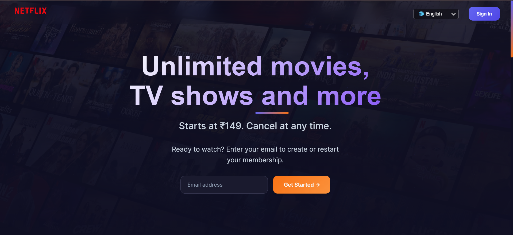
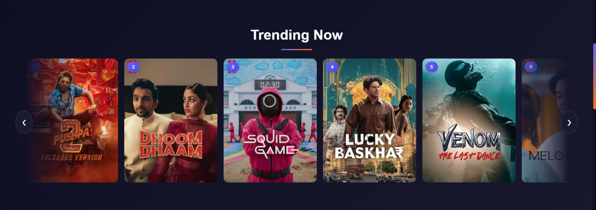
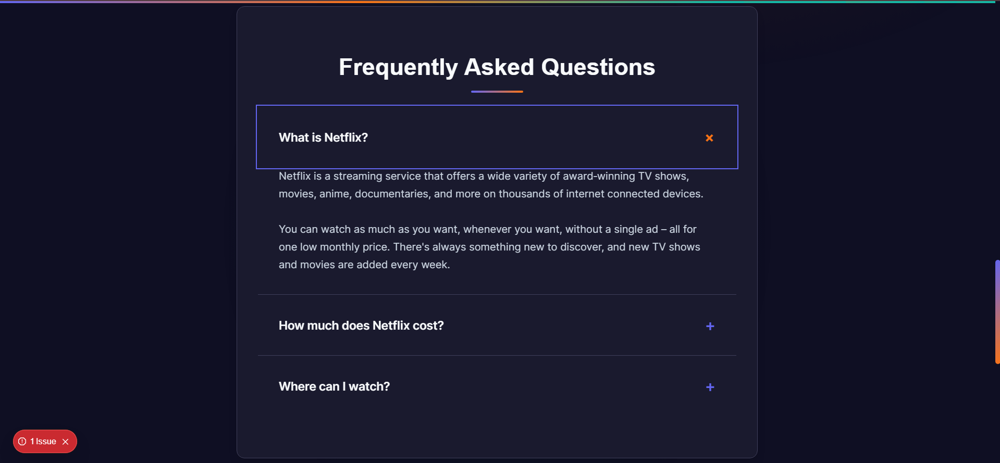

# Netflix Landing Page

A **Netflix-inspired landing page** built with **Next.js** and **React**. Fully responsive with smooth scroll animations, parallax effects, and interactive components. Designed as a modern, mobile-friendly UI clone for practice, portfolio, or demonstration purposes.

---

## Features

- **Hero Section**: Eye-catching title, subtitle, and email signup form.
- **Trending Carousel**: Horizontal sliding showcase of trending movies/shows with navigation buttons.
- **Feature Cards**: Highlights reasons to join Netflix with clean card layout.
- **FAQ Section**: Interactive accordion with smooth animations.
- **Responsive Navbar**: Mobile-friendly hamburger menu and language selector.
- **Footer**: Organized sections with links, contact, subscription form, and language selector.
- **Scroll Effects**: Smooth reveal animations, parallax elements, and scroll progress indicator.
- **Animations**: Slide-in, fade, and scale effects for enhanced user experience.

---

## Screenshots

  
  
  

---

## Technologies Used

- [Next.js](https://nextjs.org/)
- [React](https://reactjs.org/)
- HTML5 & CSS3
- JavaScript (ES6+)
- Responsive design (mobile-first)
- W3.CSS for basic styling utilities

---

## Getting Started

### Prerequisites

- Node.js >= 18
- npm >= 9

### Installation

1. Clone the repository:
   ```bash
   git clone https://github.com/aryangithub02/netflix-landing-page.git
   cd netflix-landing-page
